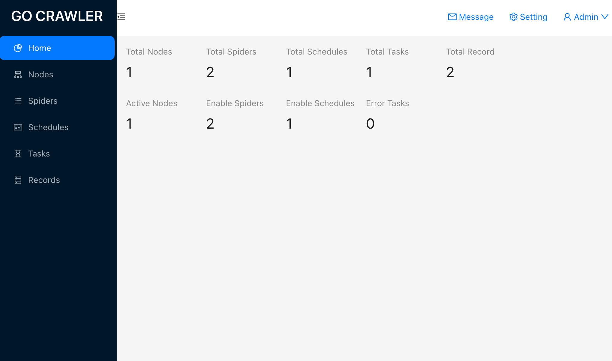
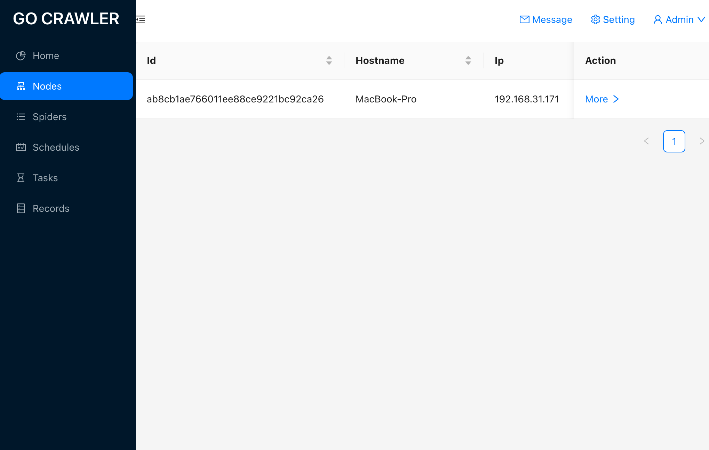
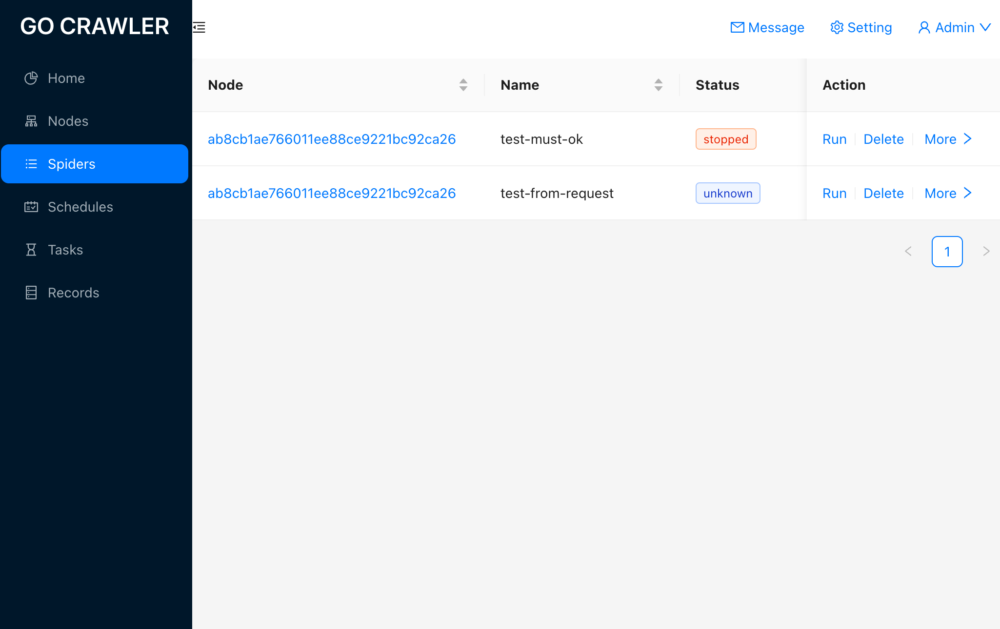
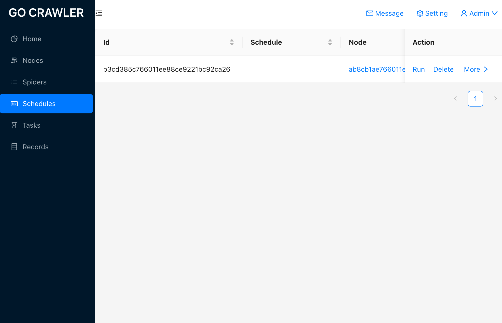
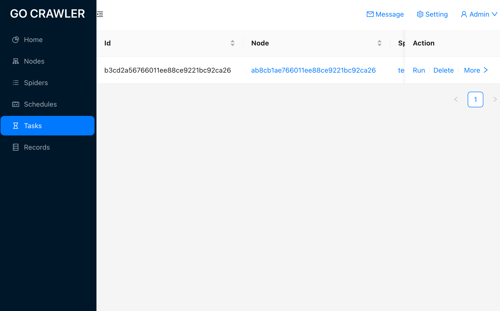
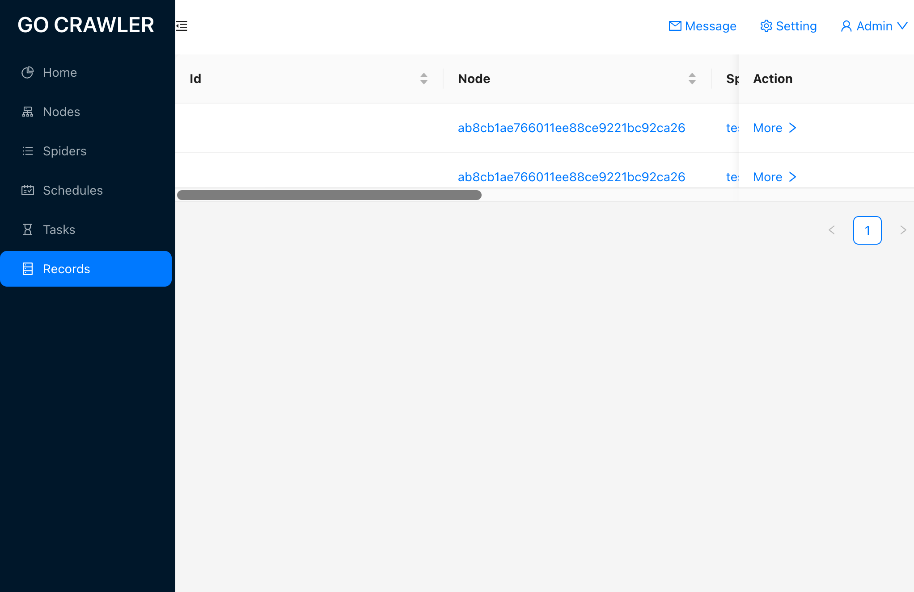

# go-crawler

基于golang实现的爬虫框架，编写简单，性能强劲。内置了丰富的实用中间件，支持多种解析、保存方式，支持分布式部署。

[go-crawler](https://github.com/lizongying/go-crawler)

[document](https://pkg.go.dev/github.com/lizongying/go-crawler)

[english](./README.md)

## 目录

1. [功能](#功能)
2. [安装](#安装)
3. [使用](#使用)
    1. [基本架构](#基本架构)
    2. [选项](#选项)
    3. [存储](#存储)
    4. [中间件](#中间件)
    5. [数据管道](#数据管道)
    6. [请求](#请求)
    7. [响应](#响应)
    8. [信号](#信号)
    9. [代理](#代理)
    10. [媒体下载](#媒体下载)
    11. [模拟服务](#模拟服务)
    12. [配置](#配置)
    13. [启动](#启动)
    14. [基于字段标签的网页解析](#基于字段标签的网页解析)
4. [api](#api)
5. [问答](#问答)
6. [示例](#示例)
7. [工具](#工具)
    1. [证书签名](#证书签名)
    2. [中间人代理](#中间人代理)
8. [待做](#待做)

## 功能

* 编写简单，性能强劲。
* 内置多种实用中间件，开发起来更轻松。
* 支持多种解析方式，解析页面更简单。
* 支持多种保存方式，数据存储更灵活。
* 提供了更多的配置选项，配置更丰富。
* 组件支持自定义，功能拓展更自由。
* 内置模拟服务，调试开发更方便。
* 支持分布式部署

## 支持情况

* 解析支持CSS、XPath、Regex、Json
* 支持Json、Csv、Mongo、Mysql、Sqlite、Kafka输出
* 支持gb2312、gb18030、gbk、big5中文解码
* 支持gzip、deflate、brotli解压缩
* 支持分布式
* 支持Redis、Kafka作为消息队列
* 支持自动Cookie、重定向
* 支持BaseAuth认证
* 支持请求重试
* 支持请求过滤
* 支持图片文件下载
* 支持图片处理
* 支持对象存储
* 支持ssl指纹修改
* 支持http2
* 支持随机请求头
* 支持模拟浏览器
* 支持浏览器ajax请求
* 支持模拟服务
* 支持优先级队列
* 支持定时任务、循环任务、单次任务
* 支持基于字段标签的解析
* 支持dns缓存
* 支持中间人代理
* 支持错误记录

## 安装

项目结构可以参照以下项目，这个项目有一些示例可以参考。克隆后可以直接进行开发：
[go-crawler-example](https://github.com/lizongying/go-crawler-example)

```shell
git clone git@github.com:lizongying/go-crawler-example.git my-crawler
cd my-crawler
go run cmd/multi_spider/*.go -c example.yml -n test1 -m once

```

### 构建

```shell
make

```

目前框架更新较为频繁, 建议保持关注，使用最新版本。
可以在项目里执行更新命令，如:

```shell
go get -u github.com/lizongying/go-crawler

# 最新发布版本
go get -u github.com/lizongying/go-crawler@latest

# 最新提交（推荐）
go get -u github.com/lizongying/go-crawler@6f52307

```

### 容器构建

```shell
# cross platform
docker buildx create --use

# for linux
docker buildx build --platform linux/amd64 -f ./cmd/test_spider/Dockerfile -t lizongying/go-crawler/test-spider:amd64 . --load

# for mac m1
docker buildx build --platform linux/arm64 -f ./cmd/test_spider/Dockerfile -t lizongying/go-crawler/test-spider:arm64 . --load
```

```shell
docker run -p 8090:8090 -d lizongying/go-crawler/test-spider:arm64 -c example.yml -f TestRedirect -m once
```

## 使用

### 基本架构

* Crawler：Crawler里可以有多个Spider，同时管理Spider的启动和关闭等。
* Spider：集成了Downloader、Exporter、Scheduler等组件。在Spider里可以发起请求和解析内容。 您需要为每个Spider设置一个唯一名称。
  `spider.WithOptions(pkg.WithName("example"))` 或 `spider.SetName("example")`

  ```go
  package main
  
  import (
      "github.com/lizongying/go-crawler/pkg"
      "github.com/lizongying/go-crawler/pkg/app"
  )
  
  type Spider struct {
      pkg.Spider
  }
  
  // some spider funcs
  
  func NewSpider(baseSpider pkg.Spider) (spider pkg.Spider, err error) {
      spider = &Spider{
          Spider: baseSpider,
      }
      spider.SetName("example")
      return
  }
  
  func main() {
      app.NewApp(NewSpider).Run()
  }
  
  ```
* Job
* Task

### 选项

Spider选项

* `WithName` 设置唯一名称。
* `WithHost` 设置host，用于基于host的过滤或robot.txt的支持。
* `WithPlatforms` 设置浏览器平台。
* `WithBrowsers` 设置浏览器。
* `WithFilter` 设置过滤器。
* `WithDownloader` 设置下载器。
* `WithExporter` 设置导出器。
* `WithMiddleware` 设置中间件。
* `WithStatsMiddleware` 设置统计中间件，用于记录和统计爬虫的性能和运行情况。
* `WithDumpMiddleware` 设置打印中间件，打印request或者response。
* `WithProxyMiddleware` 设置代理中间件，用于使用代理服务器进行爬取。
* `WithRobotsTxtMiddleware` 设置开启robots.txt支持中间件，用于遵守网站的 robots.txt 规则。
* `WithFilterMiddleware` 设置过滤器中间件，用于过滤已处理的请求。
* `WithFileMiddleware` 设置文件中间件，用于处理文件下载请求。
* `WithImageMiddleware` 设置图像中间件，用于处理图像下载请求。
* `WithHttpMiddleware` 设置 HTTP 中间件。
* `WithRetryMiddleware` 设置重试中间件，用于在请求失败时进行自动重试。
* `WithUrlMiddleware` 设置 URL 中间件。
* `WithReferrerMiddleware` 设置 Referrer 中间件，用于自动设置请求的 Referrer 头。
* `WithCookieMiddleware` 设置 Cookie 中间件，用于处理请求和响应中的 Cookie，自动在接下来的请求设置之前的 Cookie。
* `WithRedirectMiddleware` 设置重定向中间件，用于自动处理请求的重定向，跟随重定向链接并获取最终响应。
* `WithChromeMiddleware` 设置 Chrome 中间件，用于模拟 Chrome 浏览器。
* `WithHttpAuthMiddleware` 设置开启HTTP认证中间件，用于处理需要认证的网站。
* `WithCompressMiddleware` 设置压缩中间件，用于处理请求和响应的压缩。当爬虫发送请求或接收响应时，该中间件可以自动处理压缩算法，解压缩请求或响应的内容。
* `WithDecodeMiddleware` 设置解码中间件，用于处理请求和响应的解码操作。该中间件可以处理请求或响应中的编码内容。
* `WithDeviceMiddleware` 设置开启设备模拟中间件。
* `WithCustomMiddleware` 设置自定义中间件，允许用户定义自己的中间件组件。
* `WithRecordErrorMiddleware` 设置错误记录中间件，请求和解析如果出错会被记录。
* `WithPipeline` 设置Pipeline，用于处理爬取的数据并进行后续操作。
* `WithDumpPipeline` 设置打印管道，用于打印待保存的数据。
* `WithFilePipeline` 设置文件管道，用于处理爬取的文件数据，将文件保存到指定位置。
* `WithImagePipeline` 设置图像管道，用于处理爬取的图像数据，将保存图像到指定位置。
* `WithFilterPipeline` 设置过滤器管道，用于过滤爬取过的数据。
* `WithCsvPipeline` 设置 CSV 数据处理管道，将爬取的数据保存为 CSV 格式。
* `WithJsonLinesPipeline` 设置 JSON Lines 数据处理管道，将爬取的数据保存为 JSON Lines 格式。
* `WithMongoPipeline` 设置 MongoDB 数据处理管道，将爬取的数据保存到 MongoDB 数据库。
* `WithSqlitePipeline` 设置 Sqlite 数据处理管道，将爬取的数据保存到 Sqlite 数据库。
* `WithMysqlPipeline` 设置 MySQL 数据处理管道，将爬取的数据保存到 MySQL 数据库。
* `WithKafkaPipeline` 设置 Kafka 数据处理管道，将爬取的数据发送到 Kafka 消息队列。
* `WithCustomPipeline` 设置自定义数据处理管道。
* `WithRetryMaxTimes` 设置请求的最大重试次数。
* `WithRedirectMaxTimes` 设置请求的最大跳转次数。
* `WithTimeout` 设置请求的超时时间。
* `WithInterval` 设置请求的间隔时间。
* `WithOkHttpCodes` 设置正常的HTTP状态码。

crawler选项

* `WithLogger` 设置日志。
* `WithMockServerRoutes` 设置模拟服务Route，包括内置或自定义的。不需要配置`mock_server.enable: true`
* `WithItemDelay` 设置数据保存间隔。
* `WithItemConcurrency` 设置数据保存并行数量。
* `WithCDP` 初始浏览器。

### 存储

Item用于存储需要导出的数据和一些其他辅助信息。
框架里内置的Item涵盖了主要文件、数据库、消息队列等存储方式。
pkg.Item是一个接口，不能直接使用。pkg.ItemUnimplemented实现了pkg.Item的所有方法。
如果Item需要实现pkg.Item，可以组合pkg.ItemUnimplemented。 如：

```go
type ItemNone struct {
pkg.ItemUnimplemented
}

```

Item有一些通用方法：

* `Name() pkg.ItemName`
  获取Item的具体类型，如pkg.ItemNone、pkg.ItemCsv、pkg.ItemJsonl、pkg.ItemMongo、pkg.ItemSqlite、pkg.ItemMysql、pkg.ItemKafka等，用于Item反序列化到具体Item实现。
* `SetReferrer(string)` 设置referrer，可以用于记录请求的来源，一般不需要自己设置，由ReferrerMiddleware自动设置。
* `Referrer() string` 获取referrer。
* `SetUniqueKey(string)` 设置uniqueKey，可以用于过滤和其他唯一用途。
* `UniqueKey() string` 获取uniqueKey。
* `SetId(any)` 设置id，主要用于保存数据时的主键，和uniqueKey的一个区别是，id可能是在Response中产生，请求时不一定能获得。
* `Id() any` 获取id。
* `SetData(any)` 设置data，这是要存储的完整数据。为了规范化，强制要求指针类型。存储到不同的目标时，data需要设置不同的格式。
* `Data() any` 获取data。
* `DataJson() string` 获取data json字符串。
* `SetFilesRequest([]pkg.Request)` 设置文件的请求。这是一个slice，可以下载多个文件。
* `FilesRequest() []pkg.Request` 获取文件的请求。
* `SetFiles([]pkg.File)` 设置文件。下载后的文件通过这个方法设置到Item中。
* `Files() []pkg.File` 获取文件。
* `SetImagesRequest([]pkg.Request)` 设置图片的请求。这是一个slice，可以下载多个图片。
* `ImagesRequest() []pkg.Request` 获取图片的请求。
* `SetImages([]pkg.Image)` 设置图片。下载后的图片通过这个方法设置到Item中。
* `Images() []pkg.Image` 获取图片。

* 内置Item实现：框架提供了一些内置的Item实现，
  如pkg.ItemNone、pkg.ItemCsv、pkg.ItemJsonl、pkg.ItemMongo、pkg.ItemSqlite、pkg.ItemMysql、pkg.ItemKafka等。
  您可以根据需要，返回Item，并开启相应的Pipeline。如：

    ```go
    err = s.YieldItem(ctx, items.NewItemMongo(s.collection, true).
    SetUniqueKey(extra.Keyword).
    SetId(extra.Keyword).
    SetData(&data))
    
    ```

    ```go
    spider.WithOptions(pkg.WithMongoPipeline())
    ```

    * pkg.ItemNone 这个Item没有实现任何其他方法，主要用于调试。
        * `items.NewItemNone()`
    * pkg.ItemCsv 保存到csv中。
        * `items.NewItemCsv(filename string)`
        * filename：存储的文件名，不包括拓展名
    * pkg.ItemJsonl 保存到jsonl中。
        * `items.NewItemJsonl(filename string)`
        * filename：存储的文件名，不包括拓展名
    * pkg.ItemMongo 保存到mongo中。
        * `items.NewItemMongo(collection string, update bool)`
        * collection：mongo collection
        * update：如果数据已存在mongo中，是否更新
    * pkg.ItemSqlite 保存到Sqlite中。
        * `items.NewItemSqlite(table string, update bool)`
        * table：sqlite table
        * update：如果数据已存在mongo中，是否更新
    * pkg.ItemMysql 保存到mysql中。
        * `items.NewItemMysql(table string, update bool)`
        * table：mysql table
        * update：如果数据已存在mongo中，是否更新
    * pkg.ItemKafka 保存到kafka中。
        * `items.NewItemKafka(topic string)`
        * topic：kafka topic

### 中间件

middleware/pipeline包括框架内置、公共自定义（internal/middlewares，internal/pipelines）和爬虫内自定义（和爬虫同module）。
请确保不同中间件和Pipeline的order值不重复。如果有重复的order值，后面的中间件或Pipeline将替换前面的中间件或Pipeline。

在框架中，内置的中间件具有预定义的order值，这些order值是10的倍数，例如10、20、30等。
为了避免与内置中间件的order冲突，建议自定义中间件时选择不同的order值。
当您自定义中间件时，请选择避开内置中间件的order值。
根据中间件的功能和需求，按照预期的执行顺序进行配置。确保较低order值的中间件先执行，然后依次执行较高order值的中间件。
内置的中间件和自定义中间件使用默认的order值即可。
如果需要改变默认的order值，需要`spider.WithOptions(pkg.WithMiddleware(new(middleware), order)`启用该中间件并应用该order值。

* custom: 10
    * 自定义中间件
    * `spider.WithOptions(pkg.WithCustomMiddleware(new(CustomMiddleware))`
* retry: 20
    * 请求重试中间件，用于在请求失败时进行重试。
    * 默认最大重试次数为10。可以通过配置项enable_retry_middleware来启用或禁用，默认启用。
    * `spider.WithOptions(pkg.WithRetryMiddleware()`
* dump: 30
    * 控制台打印item.data中间件，用于打印请求和响应的详细信息。
    * 可以通过配置项enable_dump_middleware来启用或禁用，默认启用。
    * `spider.WithOptions(pkg.WithDumpMiddleware()`
* proxy: 40
    * 用于切换请求使用的代理。
    * 可以通过配置项enable_proxy_middleware来启用或禁用，默认启用。
    * `spider.WithOptions(pkg.WithProxyMiddleware()`
* robotsTxt: 50
    * robots.txt支持中间件，用于支持爬取网站的robots.txt文件。
    * 可以通过配置项enable_robots_txt_middleware来启用或禁用，默认禁用。
    * `spider.WithOptions(pkg.WithRobotsTxtMiddleware()`
* filter: 60
    * 过滤重复请求中间件，用于过滤重复的请求。默认只有在Item保存成功后才会进入去重队列。
    * 可以通过配置项enable_filter_middleware来启用或禁用，默认启用。
    * `spider.WithOptions(pkg.WithFilterMiddleware()`
* file: 70
    * 自动添加文件信息中间件，用于自动添加文件信息到请求中。
    * 可以通过配置项enable_file_middleware来启用或禁用，默认禁用。
    * `spider.WithOptions(pkg.WithFileMiddleware()`
* image: 80
    * 自动添加图片的宽高等信息中间件
    * 用于自动添加图片信息到请求中。可以通过配置项enable_image_middleware来启用或禁用，默认禁用。
    * `spider.WithOptions(pkg.WithImageMiddleware()`
* url: 90
    * 限制URL长度中间件，用于限制请求的URL长度。
    * 可以通过配置项enable_url_middleware和url_length_limit来启用和设置最长URL长度，默认启用和最长长度为2083。
    * `spider.WithOptions(pkg.WithUrlMiddleware()`
* referrer: 100
    * 自动添加Referrer中间件，用于自动添加Referrer到请求中。
    * 可以根据referrer_policy配置项选择不同的Referrer策略，DefaultReferrerPolicy会加入请求来源，NoReferrerPolicy不加入请求来源
    * 配置 enable_referrer_middleware: true 是否开启自动添加referrer，默认启用。
    * `spider.WithOptions(pkg.WithReferrerMiddleware()`
* cookie: 110
    * 自动添加Cookie中间件，用于自动添加之前请求返回的Cookie到后续请求中。
    * 可以通过配置项enable_cookie_middleware来启用或禁用，默认启用。
    * `spider.WithOptions(pkg.WithCookieMiddleware()`
* redirect: 120
    * 网址重定向中间件，用于处理网址重定向，默认支持301和302重定向。
    * 可以通过配置项enable_redirect_middleware和redirect_max_times来启用和设置最大重定向次数，默认启用和最大次数为1。
    * `spider.WithOptions(pkg.WithRedirectMiddleware()`
* chrome: 130
    * 模拟Chrome中间件，用于模拟Chrome浏览器。
    * 可以通过配置项enable_chrome_middleware来启用或禁用，默认启用。
    * `spider.WithOptions(pkg.WithChromeMiddleware()`
* httpAuth: 140
    * HTTP认证中间件，通过提供用户名（username）和密码（password）进行HTTP认证。
    * 需要在具体的请求中设置用户名和密码。可以通过配置项enable_http_auth_middleware来启用或禁用，默认禁用。
    * `spider.WithOptions(pkg.WithHttpAuthMiddleware()`
* compress: 150
    * 支持gzip/deflate/br解压缩中间件，用于处理响应的压缩编码。
    * 可以通过配置项enable_compress_middleware来启用或禁用，默认启用。
    * `spider.WithOptions(pkg.WithCompressMiddleware()`
* decode: 160
    * 中文解码中间件，支持对响应中的GBK、GB2312、GB18030和Big5编码进行解码。
    * 可以通过配置项enable_decode_middleware来启用或禁用，默认启用。
    * `spider.WithOptions(pkg.WithDecodeMiddleware()`
* device: 170
    * 修改请求设备信息中间件，用于修改请求的设备信息，包括请求头（header）和TLS信息。目前只支持User-Agent随机切换。
    * 需要设置设备范围（Platforms）和浏览器范围（Browsers）。
    * Platforms: Windows/Mac/Android/Iphone/Ipad/Linux
    * Browsers: Chrome/Edge/Safari/FireFox
    * 可以通过配置项enable_device_middleware来启用或禁用，默认禁用。
    * `spider.WithOptions(pkg.WithDeviceMiddleware()`
* http: 200
    * 创建请求中间件，用于创建HTTP请求。
    * 可以通过配置项enable_http_middleware来启用或禁用，默认启用。
    * `spider.WithOptions(pkg.WithHttpMiddleware()`
* stats: 210
    * 数据统计中间件，用于统计爬虫的请求、响应和处理情况。
    * 可以通过配置项enable_stats_middleware来启用或禁用，默认启用。
    * `spider.WithOptions(pkg.WithStatsMiddleware()`
* recordError: 220
    * 错误记录中间件，用于记录请求，以及请求和解析中出现的错误。
    * 可以通过配置项enable_record_error_middleware来启用或禁用，默认禁用。
    * `spider.WithOptions(pkg.WithRecordErrorMiddleware())`

### 数据管道

用于流式处理Item，如数据过滤、数据存储等。
通过配置不同的Pipeline，您可以方便地处理Item并将结果保存到不同的目标，如控制台、文件、数据库或消息队列中。
内置的Pipeline和自定义Pipeline使用默认的order值即可。
如果需要改变默认的order值，需要`spider.WithOptions(pkg.WithPipeline(new(pipeline), order)`启用该Pipeline并应用该order值。

* dump: 10
    * 用于在控制台打印Item的详细信息。
    * 您可以通过配置enable_dump_pipeline来控制是否启用该Pipeline，默认启用。
    * `spider.WithOptions(pkg.WithDumpPipeline()`
* file: 20
    * 用于下载文件并保存到Item中。
    * 您可以通过配置enable_file_pipeline来控制是否启用该Pipeline，默认启用。
    * `spider.WithOptions(pkg.WithFilePipeline()`
* image: 30
    * 用于下载图片并保存到Item中。
    * 您可以通过配置enable_image_pipeline来控制是否启用该Pipeline，默认启用。
    * `spider.WithOptions(pkg.WithImagePipeline()`
* filter: 200
    * 用于对Item进行过滤。
    * 它可用于去重请求，需要在中间件同时启用filter。
    * 默认情况下，Item只有在成功保存后才会进入去重队列。
    * 您可以通过配置enable_filter_pipeline来控制是否启用该Pipeline，默认启用。
    * `spider.WithOptions(pkg.WithFilterPipeline()`
* none: 101
    * item不做任何处理，但会认为结果已保存。
    * 您可以通过配置enable_none_pipeline来控制是否启用该Pipeline，默认启用。
    * `spider.WithOptions(pkg.WithNonePipeline()`
* csv: 102
    * 用于将结果保存到CSV文件中。
    * 需要在ItemCsv中设置`FileName`，指定保存的文件名称（不包含.csv扩展名）。
    * 您可以使用tag `column:""`来定义CSV文件的列名。
    * 您可以通过配置enable_csv_pipeline来控制是否启用该Pipeline，默认关闭。
    * `spider.WithOptions(pkg.WithCsvPipeline()`
* jsonLines: 103
    * 用于将结果保存到JSON Lines文件中。
    * 需要在ItemJsonl中设置`FileName`，指定保存的文件名称（不包含.jsonl扩展名）。
    * 您可以使用tag `json:""`来定义JSON Lines文件的字段。
    * 您可以通过配置enable_json_lines_pipeline来控制是否启用该Pipeline，默认关闭。
    * `spider.WithOptions(pkg.WithJsonLinesPipeline()`
* mongo: 104
    * 用于将结果保存到MongoDB中。
    * 需要在ItemMongo中设置`Collection`，指定保存的collection名称。
    * 您可以使用tag `bson:""`来定义MongoDB文档的字段。
    * 您可以通过配置enable_mongo_pipeline来控制是否启用该Pipeline，默认关闭。
    * `spider.WithOptions(pkg.WithMongoPipeline()`
* sqlite: 105
    * 用于将结果保存到Sqlite中。
    * 需要在ItemSqlite中设置`Table`，指定保存的表名。
    * 您可以使用tag `column:""`来定义Sqlite表的列名。
    * 您可以通过配置enable_sqlite_pipeline来控制是否启用该Pipeline，默认关闭。
    * `spider.WithOptions(pkg.WithSqlitePipeline()`
* mysql: 106
    * 用于将结果保存到MySQL中。
    * 需要在ItemMysql中设置`Table`，指定保存的表名。
    * 您可以使用tag `column:""`来定义MySQL表的列名。
    * 您可以通过配置enable_mysql_pipeline来控制是否启用该Pipeline，默认关闭。
    * `spider.WithOptions(pkg.WithMysqlPipeline()`
* kafka: 107
    * 用于将结果保存到Kafka中。
    * 需要在ItemKafka中设置`Topic`，指定保存的主题名。
    * 您可以使用tag `json:""`来定义Kafka消息的字段。
    * 您可以通过配置enable_kafka_pipeline来控制是否启用该Pipeline，默认关闭。
    * `spider.WithOptions(pkg.WithKafkaPipeline()`
* custom: 110
    * 自定义pipeline
    * `spider.WithOptions(pkg.WithCustomPipeline(new(CustomPipeline))`

### 请求

创建一个请求

```go
  // 创建一个请求
req := request.NewRequest()

// 设置URL
req.SetUrl("")

// 设置请求方法
req.SetMethod(http.MethodGet)

// 设置一个请求头
req.SetHeader("name", "value")

// 一次设置所有请求头
req.SetHeaders(map[string]string{"name1": "value1", "name2": "value2"})

// 设置字符串请求体
req.SetBodyStr(``)

// 设置字节数组请求体
req.SetBodyBytes([]byte(``))

// 设置解析方法
var parse func (ctx pkg.Context, response pkg.Response) (err error)
req.SetCallBack(parse)

// 返回请求
s.UnsafeYieldRequest(ctx, req)

// 建议这么写，更简单
s.UnsafeYieldRequest(ctx, request.NewRequest().
SetUrl("").
SetBodyStr(``).
SetExtra(&Extra{}).
SetCallBack(s.Parse))
```

创建请求的简单方法

```go
_ = request.Get()
_ = request.Post()
_ = request.Head()
_ = request.Options()
_ = request.Delete()
_ = request.Put()
_ = request.Patch()
_ = request.Trace()
```

* `SetFingerprint(string) Request`

  现在很多网站都对ssl指纹进行了风控，通过设置此参数，可以进行伪装。

  如果fingerprint是`pkg.Browser`,框架会自动选择此浏览器合适的指纹。

  如果fingerprint是ja3格式指纹，框架会应用此ssl指纹。

  如果fingerprint为空，框架会根据user-agent进行选择。

  注意框架仅会在`enable_ja3 = true` 的情况下进行修改，默认使用golang自身的ssl配置。

* `SetClient(Client) Request`

  一些网站可能会识别浏览器指纹，这种情况下建议使用模拟浏览器。

  设置Client为`pkg.Browser`后，框架会自动启用模拟浏览器。

* `SetAjax(bool) Request` 如果需要使用无头浏览器，并且请求是ajax，请设置此选项为true，框架会进行xhr请求。可能需要设置referrer。

### 响应

框架内置了多个解析模块。您可以根据具体的爬虫需求，选择适合您的解析方式。

* `Xpath() (*xpath.Selector, error)` `MustXpath() *xpath.Selector`

  返回Xpath选择器，具体语法请参考 [go-xpath](https://github.com/lizongying/go-xpath)

* `Css() (*css.Selector, error)` `MustCss() *css.Selector`

  返回CSS选择器，具体语法请参考 [go-query](https://github.com/lizongying/go-css)

* `Json() (*gson.Selector, error)` `MustJson() gjson.Result`

  返回gjson选择器，具体语法请参考 [go-json](https://github.com/lizongying/go-json)

* `Re() (*re.Selector, error)` `MustRe() *re.Selector`

  返回正则选择器，具体语法请参考 [go-re](https://github.com/lizongying/go-re)

* `AllLink() []*url.URL`

  可以获取response中的所有链接。

* `BodyText() string`

  可以获取清理过html标签的正文，处理比较粗糙。

* `AbsoluteURL(relativeUrl string) (absoluteURL *url.URL, err error)`

  可以获取url绝对地址

### 信号

通过信号可以获取爬虫事件。

* `CrawlerChanged`: 程序状态已变化。通过`RegisterCrawlerChanged(FnCrawlerChanged)`注册。
* `SpiderChanged`: 爬虫状态已变化。通过`RegisterSpiderChanged(FnSpiderChanged)`注册。
* `JobChanged`: 计划任务状态已变化。通过`RegisterJobChanged(FnJobChanged)`注册。
* `TaskChanged`: 任务状态已变化。通过`RegisterTaskChanged(FnTaskChanged)`注册。
* `RequestChanged`: 请求状态已变化。通过`RegisterRequestChanged(FnRequestChanged)`注册。
* `ItemChanged`: 数据状态已变化。通过`RegisterItemChanged(FnItemChanged)`注册。

### 代理

* 自行搭建隧道代理：您可以使用 [go-proxy](https://github.com/lizongying/go-proxy)
  等工具来搭建隧道代理。这些代理工具可以提供随机切换的代理功能，对调用方无感知，方便使用。
  您可以在爬虫框架中集成这些代理工具，以便在爬虫请求时自动切换代理。
  这是一个随机切换的隧道代理，调用方无感知，方便使用。后期会加入一些其他的调用方式，比如维持原来的代理地址。这样可以提供更大灵活性，以满足不同的代理需求。
* 爬虫中配置：目前仅支持随机切

### 媒体下载

* 如果您希望将文件保存到S3等对象存储中，需要进行相应的配置
* 文件下载
    * 在Item中设置Files请求：在Item中，您需要设置Files请求，即包含要下载的文件的请求列表。
      可以使用`item.SetFilesRequest([]pkg.Request{...})`
      方法设置请求列表。
    * Item.data：您的Item.data字段需要实现pkg.File的切片，用于保存下载文件的结果。
      该字段的名称必须是Files，如`type DataFile struct {Files []*media.File}`。

      `SetData(&DataFile{})`
    * 可以设定返回的字段 Files []*media.File `json:"files" field:"url,name,ext"`
* 图片下载
    * 在Item中设置Images请求：在Item中，您需要设置Images请求，即包含要下载的图片的请求列表。
      可以使用item.SetImagesRequest([]pkg.Request{...})方法设置请求列表。
    * Item.data：您的Item.data字段需要实现pkg.Image的切片，用于保存下载图片的结果。
      该字段的名称必须是Images，如`type DataImage struct {Images []*media.Image}`。

      `SetData(&DataImage{})`
    * 可以设定返回的字段 Images []*media.Image `json:"images" field:"url,name,ext,width,height"`

### 模拟服务

为了方便开发和调试，框架内置了本地mockServer，在`mock_server.enable: true`配置下会启用。
通过使用本地mockServer，您可以在开发和调试过程中更方便地模拟和观察网络请求和响应，以及处理自定义路由逻辑。
这为开发者提供了一个便捷的工具，有助于快速定位和解决问题。
您可以自定义路由（route），只需要实现`pkg.Route` 接口，并通过在Spider中调用`AddMockServerRoutes(...pkg.Route)`
方法将其注册到mockServer中。

* 支持http和https，您可以通过设置`mock_server`选项来指定mockServer的URL。
  `http://localhost:8081`表示使用HTTP协议，`https://localhost:8081`表示使用HTTPS协议。
* 默认显示JA3指纹。JA3是一种用于TLS客户端指纹识别的算法，它可以显示与服务器建立连接时客户端使用的TLS版本和加密套件等信息。
* 您可以使用tls工具来生成服务器的私钥和证书，以便在mockServer中使用HTTPS。tls工具可以帮助您生成自签名的证书，用于本地开发和测试环境。
* mockServer内置了多种Route，这些Route提供了丰富的功能，可以模拟各种网络情景，帮助进行开发和调试。
  您可以根据需要选择合适的route，并将其配置到mockServer中，以模拟特定的网络响应和行为。
    * BadGatewayRoute 模拟返回502状态码
    * Big5Route 模拟使用big5编码
    * BrotliRoute 模拟使用brotli压缩
    * CookieRoute 模拟返回cookie
    * DeflateRoute 模拟使用Deflate压缩
    * FileRoute 模拟输出文件
    * Gb2312Route 模拟使用gb2312编码
    * Gb18030Route 模拟使用gb18030编码
    * GbkRoute 模拟使用gbk编码
    * GzipRoute 模拟使用gzip压缩
    * HelloRoute 打印请求的header和body信息
    * HtmlRoute 模拟返回html静态文件，可以把html文件放在/static/html/目录内，用于网页解析测试，不用重复请求
    * HttpAuthRoute 模拟http-auth认证
    * InternalServerErrorRoute 模拟返回500状态码
    * OkRoute 模拟正常输出，返回200状态码
    * RateLimiterRoute 模拟速率限制，目前基于全部请求，不区分用户。可与HttpAuthRoute配合使用。
    * RedirectRoute 模拟302临时跳转，需要同时启用OkRoute
    * RobotsTxtRoute 返回robots.txt文件

### 配置

在配置文件中的是全局配置，部分配置可以在爬虫中或者具体的请求中进行修改覆盖。
配置文件需要在启动时通过环境变量或参数指定，以下是配置参数：

* `env: dev` 环境。dev环境下不会写入数据库。
* `bot_name: crawler` 项目名

数据库配置：

* `mongo_enable:` 是否启用MongoDB。
* `mongo.example.uri:` MongoDB的URI。
* `mongo.example.database:` MongoDB的数据库名称。
* `mysql_enable:` 是否启用MySQL。
* `mysql.example.uri:` MySQL的URI。
* `mysql.example.database:` MySQL的数据库名称。
* `redis_enable:` 是否启用Redis。
* `redis.example.addr:` Redis的地址。
* `redis.example.password:` Redis的密码。
* `redis.example.db:` Redis的数据库。
* `sqlite.0.name:` sqlite名称，自定义
* `sqlite.0.path:` sqlite文件地址
* `store.0.name:` 存储名称，自定义
* `store.0.type:` 存储方式（如s3、cos、oss、minio、file等）
* `store.0.endpoint:` 对象存储的地址或者本地文件存储地址如“file://tmp/”
* `store.0.region:` 对象存储的区域。
* `store.0.id:` 对象存储的ID。
* `store.0.key:` 对象存储的密钥。
* `store.0.bucket:` 对象存储的桶名称。
* `kafka_enable:` 是否启用Kafka。
* `kafka.example.uri:` Kafka的URI。

日志配置：

* `log.filename:` 日志文件路径。可以使用"{name}"的方式替换成`-ldflags`的参数。
* `log.long_file:` 如果设置为true（默认），则记录完整文件路径。
* `log.level:` 日志级别，可选DEBUG/INFO/WARN/ERROR。

* `mock_server`: 模拟服务
    * `enable: false` 是否启用模拟服务
    * `host: https://localhost:8081` 模拟服务的地址。
    * `client_auth: 0` 客户端验证类型，0 不验证。

中间件和Pipeline配置

* `enable_stats_middleware:` 是否开启统计中间件，默认启用。
* `enable_dump_middleware:` 是否开启打印请求和响应中间件，默认启用。
* `enable_filter_middleware:` 是否开启过滤中间件，默认启用。
* `enable_file_middleware:` 是否开启文件处理中间件，默认启用。
* `enable_image_middleware:` 是否开启图片处理中间件，默认启用。
* `enable_http_middleware:` 是否开启HTTP请求中间件，默认启用。
* `enable_retry_middleware:` 是否开启请求重试中间件，默认启用。
* `enable_referrer_middleware:` 是否开启Referrer中间件，默认启用。
* `referrer_policy:` 设置Referrer策略，可选值为DefaultReferrerPolicy（默认）和NoReferrerPolicy。
* `enable_http_auth_middleware:` 是否开启HTTP认证中间件，默认关闭。
* `enable_cookie_middleware:`  是否开启Cookie中间件，默认启用。
* `enable_url_middleware:` 是否开启URL长度限制中间件，默认启用。
* `url_length_limit:` URL的最大长度限制，默认2083。
* `enable_compress_middleware:` 是否开启响应解压缩中间件（gzip、deflate），默认启用。
* `enable_decode_middleware:` 是否开启中文解码中间件（GBK、GB2312、Big5编码），默认启用。
* `enable_redirect_middleware:` 是否开启重定向中间件，默认启用。
* `redirect_max_times:` 重定向的最大次数，默认10。
* `enable_chrome_middleware:` 是否开启Chrome模拟中间件，默认启用。
* `enable_device_middleware:` 是否开启设备模拟中间件，默认关闭。
* `enable_proxy_middleware:` 是否开启代理中间件，默认启用。
* `enable_robots_txt_middleware:` 是否开启robots.txt支持中间件，默认关闭。
* `enable_record_error_middleware:` 是否开启record_error支持中间件，默认关闭。
* `enable_dump_pipeline:` 是否开启打印Item Pipeline，默认启用。
* `enable_none_pipeline:` 是否开启none Pipeline，默认关闭。
* `enable_file_pipeline:` 是否开启文件下载Pipeline，默认启用。
* `enable_image_pipeline:` 是否开启图片下载Pipeline，默认启用。
* `enable_filter_pipeline:` 是否开启过滤Pipeline，默认启用。
* `enable_csv_pipeline:` 是否开启csv Pipeline，默认关闭。
* `enable_json_lines_pipeline:` 是否开启json lines Pipeline，默认关闭。
* `enable_mongo_pipeline:` 是否开启mongo Pipeline，默认关闭。
* `enable_sqlite_pipeline:` 是否开启sqlite Pipeline，默认关闭。
* `enable_mysql_pipeline:` 是否开启mysql Pipeline，默认关闭。
* `enable_kafka_pipeline:` 是否开启kafka Pipeline，默认关闭。
* `enable_priority_queue:` 是否开启优先级队列，默认开启，目前只支持redis。

其他配置：

* proxy.example: 代理。
* request.concurrency: 请求并发数。
* request.interval: 请求间隔时间（毫秒）。默认1000毫秒（1秒）。
* request.timeout: 请求超时时间（秒）。默认60秒（1分钟）。
* request.ok_http_codes: 请求正常的HTTP状态码。
* request.retry_max_times: 请求重试的最大次数，默认10。
* request.http_proto: 请求的HTTP协议。默认`2.0`
* enable_ja3: 是否修改/打印JA3指纹。默认关闭。
* scheduler: 调度方式，默认memory（内存调度），可选值memory、redis、kafka。选择redis或kafka后可以实现集群调度。
* filter: 过滤方式，默认memory（内存过滤），可选值memory、redis。选择redis后可以实现集群过滤。

### 启动

通过配置环境变量或参数，您可以更灵活地启动爬虫，包括选择配置文件、指定爬虫名称、指定初始方法、传递额外参数以及设定启动模式。

项目结构

* 建议按照每个网站（子网站）或者每个业务为一个spider。不必分的太细，也不必把所有的网站和业务都写在一个spider里
* 可以每个爬虫单独打包，也可以多个爬虫也可以组合到一起, 减少文件数量。但执行的时候只能启动一个爬虫

```go
app.NewApp(NewExample1Spider, NewExample2Spider).Run()

```

```shell
spider -c example.yml -n example -f TestOk -m once
```

* 配置文件路径，必须进行配置。建议不同环境使用不同的配置文件。
    * 环境变量 `CRAWLER_CONFIG_FILE`
    * 启动参数 `-c`
* 爬虫名称，必须进行配置。
    * 环境变量 `CRAWLER_NAME`
    * 启动参数 `-n`
* 初始方法名称，默认Test，注意大小写需一致。
    * 环境变量 `CRAWLER_FUNC`
    * 启动参数 `-f`
* 额外的参数，该参数是非必须项。建议使用JSON字符串。参数会被传递到初始方法中。
    * 环境变量 `CRAWLER_ARGS`
    * 启动参数 `-a`
* 模式，默认为0(manual)。您可以根据需要使用不同的模式。
    * 环境变量 `CRAWLER_MODE`
    * 启动参数 `-m`
    * 可选值
        * 0: manual 手动执行，默认不执行，可以通过api进行管理。
        * 1: once 只执行一次
        * 2: loop 一直重复执行
        * 3: cron 定时执行
* 定时任务。只有在模式为cron下，才会应用此配置。如"1s/2i/3h/4d/5m/6w"
    * 环境变量 `CRAWLER_SPEC`
    * 启动参数 `-s`

### 基于字段标签的网页解析

在本框架里，返回的数据是个结构体。我们仅需在字段上加上解析规则的标签，框架会自动进行网页解析，看起来非常简洁。
这对于一些简单的爬虫来说，更加便捷高效。特别是需要添加大量的通用爬虫时，仅需要配置这些标签就可以直接解析。
比如：

```go
type DataRanks struct {
Data []struct {
Name           string  `_json:"name"`
FullName       string  `_json:"fullname"`
Code           string  `_json:"code"`
MarketBalue    int     `_json:"market_value"`
MarketValueUsd int     `_json:"market_value_usd"`
Marketcap      int     `_json:"marketcap"`
Turnoverrate   float32 `_json:"turnoverrate"`
} `_json:"data"`
}

```

data可以设置根解析`_json:"data"`， 也就是里面的字段都是在根解析下，仅需要写属性就可以了。`_json:"name"`

根标签和子标签可以混用，比如根标签用xpath，子标签用json

可以使用如下标签：

* `_json:""` gjson 格式
* `_xpath:""` xpath 格式
* `_css:""` css 格式
* `_re:""` re 格式

## Api

```shell
go run cmd/multi_spider/*.go -c example.yml
```

```shell
# index
curl "http://127.0.0.1:8090" -H "Content-Type: application/json"

# spiders
curl "http://127.0.0.1:8090/spiders" -X POST -H "Content-Type: application/json" -H "X-API-Key: 8c6976e5b5410415bde908bd4dee15dfb167a9c873fc4bb8a81f6f2ab448a918"

# job run
# once
curl "http://127.0.0.1:8090/job/run" -X POST -d '{"timeout": 2, "name": "test-must-ok", "func": "TestOk", "args": "", "mode": 1}' -H "Content-Type: application/json" -H "X-API-Key: 8c6976e5b5410415bde908bd4dee15dfb167a9c873fc4bb8a81f6f2ab448a918"
# {"code":0,"msg":"","data":{"id":"133198dc7a0911ee904b9221bc92ca26","start_time":0,"finish_time":0}}

# loop
curl "http://127.0.0.1:8090/job/run" -X POST -d '{"timeout": 2000, "name": "test-must-ok", "func": "TestOk", "args": "", "mode": 2}' -H "Content-Type: application/json" -H "X-API-Key: 8c6976e5b5410415bde908bd4dee15dfb167a9c873fc4bb8a81f6f2ab448a918"
# {"code":0,"msg":"","data":{"id":"133198dc7a0911ee904b9221bc92ca26","start_time":0,"finish_time":0}}

# job stop
curl "http://127.0.0.1:8090/job/stop" -X POST -d '{"spider_name": "test-must-ok", "job_id": "894a6fe87e2411ee95139221bc92ca26"}' -H "Content-Type: application/json" -H "X-API-Key: 8c6976e5b5410415bde908bd4dee15dfb167a9c873fc4bb8a81f6f2ab448a918"
# {"code":0,"msg":"","data":{"name":"test-must-ok"}}

# job rerun
curl "http://127.0.0.1:8090/job/rerun" -X POST -d '{"spider_name": "test-must-ok", "job_id": "894a6fe87e2411ee95139221bc92ca26"}' -H "Content-Type: application/json" -H "X-API-Key: 8c6976e5b5410415bde908bd4dee15dfb167a9c873fc4bb8a81f6f2ab448a918"
# {"code":0,"msg":"","data":{"name":"test-must-ok"}}

```

### 界面

你可以直接使用https://lizongying.github.io/go-crawler/

如果查看demo，请信任证书
[ca](./static/tls/ca.crt)

开发

```shell
npm run dev --prefix ./web/ui

# docs
hugo server --source docs --noBuildLock
```

构建

web_server 非必须项，你可以直接使用nginx等网络服务

```shell
# ui
make web_ui

# server
make web_server

```

运行

```shell
./releases/web_server
```








## 问答

* 一些框架里都有start_urls，此框架中怎么设置？

  本框架里，去掉了这种方式。可以显式地在初始方法里建立request，可以对request进行额外地处理，实际上可能会更方便些。
    ```go
    startUrls := []string{"/a.html", "/b.html"}
    for _, v:=range startUrls {
		if err = s.YieldRequest(ctx, request.NewRequest().
            SetUrl(fmt.Sprintf("https://a.com%s", v)).
            SetCallBack(s.Parse)); err != nil {
            s.logger.Error(err)
        }
    }

    ```

* 有哪些可以提高爬虫性能的方式？

  要提高爬虫的性能，您可以考虑关闭一些未使用的中间件或Pipeline，以减少不必要的处理和资源消耗。在禁用中间件或Pipeline之前，请评估其对爬虫性能的实际影响。确保禁用的部分不会对功能产生负面影响。

* 为什么item没有实现分布式队列？

  由爬虫处理自己的请求即可，没必要处理其他爬虫的请求。
  所以本框架虽架构上有预留，但不会去用其他外部队列代替本程序内存队列。
  如处理出现性能问题，建议将结果输出到队列。

* 如何设定请求的优先级？

  优先级允许0-2147483647。
  0的优先级最高，最先被处理。
  暂只支持基于redis的优先级队列。
  使用方法

    ```go
    request.SetPriority(0)
    ```

* 爬虫什么时候结束？

  正常情况下，达到以下条件，会判定任务结束，程序关闭：

    1. 请求和解析方法都已执行完毕
    2. item队列为空
    3. request队列为空

* 如何阻止爬虫停止？

  在`Stop`方法中返回`pkg.DontStopErr`即可

    ```go
    package main
    
    import "github.com/lizongying/go-crawler/pkg"
    
    func (s *Spider) Stop(_ pkg.Context) (err error) {
        err = pkg.DontStopErr
        return
    }
    
    ```

* 任务队列使用`request`、`extra`还是`unique_key`?

  首先说明的是，这三个词都是本框架中的概念：
    * `request` 包含了request的所有字段，包括url、method、headers等，甚至经过了中间件处理。缺点是占用空间大，作为队列的值有点浪费。
    * `extra`
      是request中的一个结构体字段，在框架的设计里是包含能够构造唯一的请求（大多数情况下）。比如一个分类下的列表页，可能包含分类id、页码；比如一个详情页，可能包含详情id。为了兼容更多的语言，在队列中的存储形式为json格式，比较节约空间，推荐使用。
    * `unique_key`
      是框架里请求的唯一标识，是一个字符串。在一些情况下，是可以代表唯一的，但在需要多个字段联合唯一的情况下会比较麻烦，比如列表页，比如分类加id的详情页等。如果内存（redis等使用）紧张，可以使用。但为了更加通用，可能使用
      `extra`
      更加方便。

  入队：
    * `YieldExtra`或`MustYieldExtra`或`UnsafeYieldExtra`

  出队:
    * `GetExtra`或`MustGetExtra`

* 该不该使用`Must[method]`，如`MustYieldRequest`?

  `Must[method]`更加简洁，但可能对于排查错误不太方便，并且遇到错误会退出。是不是用，需要看使用者的个人风格。
  如果需要特殊处理err，就需要使用普通的方法了，如`YieldRequest`。

* 该不该使用`Unsafe[method]`，如`UnsafeYieldRequest`?

  `Unsafe[method]`更加简洁，但可能对于排查错误不太方便。是不是用，需要看使用者的个人风格。
  如果需要特殊处理err，就需要使用普通的方法了，如`YieldRequest`。

* 其他

    * 升级go-crawler
    * 清理缓存

## 示例

example_spider.go

```go
package main

import (
	"github.com/lizongying/go-crawler/pkg"
	"github.com/lizongying/go-crawler/pkg/app"
	"github.com/lizongying/go-crawler/pkg/items"
	"github.com/lizongying/go-crawler/pkg/request"
)

const (
	name     = "example"
	host     = "https://httpbin.org"
	okUrl    = "/get"
	jsonName = "example"
)

type ExtraOk struct {
	Count int
}

type DataOk struct {
	Count int
}

type Spider struct {
	pkg.Spider
}

func (s *Spider) ParseOk(ctx pkg.Context, response pkg.Response) (err error) {
	var extra ExtraOk
	response.UnsafeExtra(&extra)

	s.UnsafeYieldItem(ctx, items.NewItemNone().
		SetData(&DataOk{
			Count: extra.Count,
		}))

	if extra.Count > 0 {
		s.Logger().Info("manual stop")
		return
	}

	s.UnsafeYieldRequest(ctx, request.NewRequest().
		SetUrl(response.Url()).
		SetExtra(&ExtraOk{
			Count: extra.Count + 1,
		}).
		SetCallBack(s.ParseOk))
	return
}

func (s *Spider) TestOk(ctx pkg.Context, _ string) (err error) {
	s.UnsafeYieldRequest(ctx, request.NewRequest().
		SetUrl(okUrl).
		SetExtra(&ExtraOk{}).
		SetCallBack(s.ParseOk))
	return
}

func NewSpider(baseSpider pkg.Spider) (spider pkg.Spider, err error) {
	spider = &Spider{
		Spider: baseSpider,
	}
	spider.SetName(name).SetHost(host).WithJsonLinesPipeline()
	return
}

func main() {
	app.NewApp(NewSpider).Run()
}

```

### 运行

```shell
go run example_spider.go -c example.yml -n example -f TestOk -m once

```

更多示例可以参照以下项目

[go-crawler-example](https://github.com/lizongying/go-crawler-example)

## 工具

### 生成爬虫

* -n 爬虫名字
* -f 强制覆盖
* -h 帮助

```shell
go run tools/spider_generator/*.go
```

### 证书签名

* -s 自签名服务器证书。如果不设置，会使用本项目默认ca证书进行签名
* -c 新创建ca证书。如果不设置，会使用本项目默认ca证书
* -i 添加服务器ip，逗号分割
* -n 添加服务器域名，逗号分割

开发

```shell
go run tools/tls_generator/*.go
```

构建

```
# 构建
make tls_generator

# 使用
./releases/tls_generator
```

### 中间人代理

```shell
# 默认打印请求和返沪内容
# -f 正则过滤请求
# -p 设置请求代理
# -r 替换返回内容
./releases/mitm

# 测试
# 其他客户端需要信任ca证书 static/tls/ca_crt.pem
curl https://www.baidu.com -x http://localhost:8082 --cacert static/tls/ca.crt
curl https://github.com/lizongying/go-crawler -x http://localhost:8082 --cacert static/tls/ca.crt

```

## 待做

* AutoThrottle
* monitor
* statistics
* panic stop
* extra
* request context
* total
* status
* api option
* branch/version/time
* crawler spider job task change
* response 图片和文本同时存在？

```shell
go get -u github.com/lizongying/go-css@latest
go get -u github.com/lizongying/go-css@b584971
go get -u github.com/lizongying/go-xpath@latest
go get -u github.com/lizongying/go-xpath@f46eb0e
go get -u github.com/lizongying/go-re@latest
go get -u github.com/lizongying/go-re@1b48356
go get -u github.com/lizongying/go-json@latest
go get -u github.com/lizongying/go-json@7915011
go get -u github.com/lizongying/cron@simple-v2

```